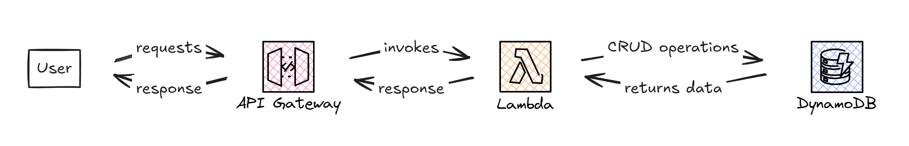

# Project Description

A Serverless1 API written in Go leveraging the following AWS Services:
- AWS API Gateway
- AWS Lambda
- AWS DynamoDB

The API supports the following operations:
- GetUser
- GetUsers
- Create User
- UpdateUser
- Delete User

Supported Terraform resources:
- AWS API Gateway
- AWS Lambda
- AWS DynamoDB
- AWS CloudWatch

# Architecture

